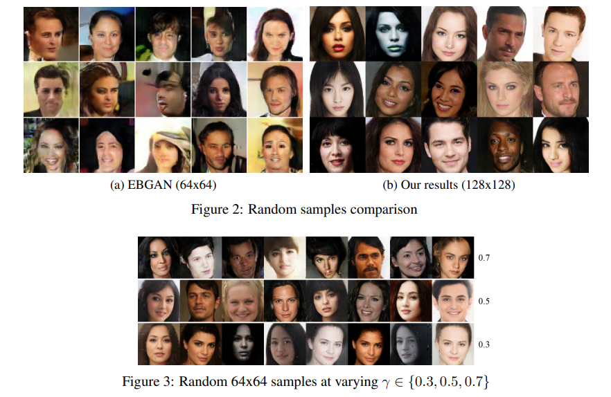
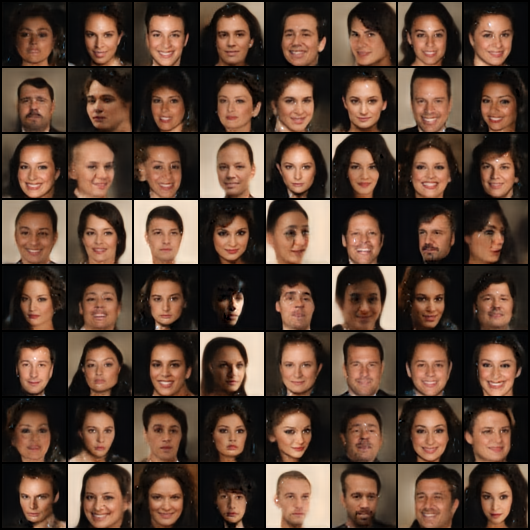

# BEGAN-pytorch

 PyTorch implementation of [Boundary Equilibrium Generative Adversarial Networks](https://arxiv.org/abs/1703.10717).
 
 BEGAN produce a new equilibrium enforcing method paired with a loss derived from the Wasserstein distance for training auto-encoder based Generative Adversarial Networks. This method balances the generator and discriminator during training. Additionally, it provides a new approximate convergence measure, fast and stable training and high visual quality.
 
 
 
 
 ## Results
 
 200K steps on celebA (64x64) (gamma = 0.5, lr = 0.00008, 0.00004)
 
 

